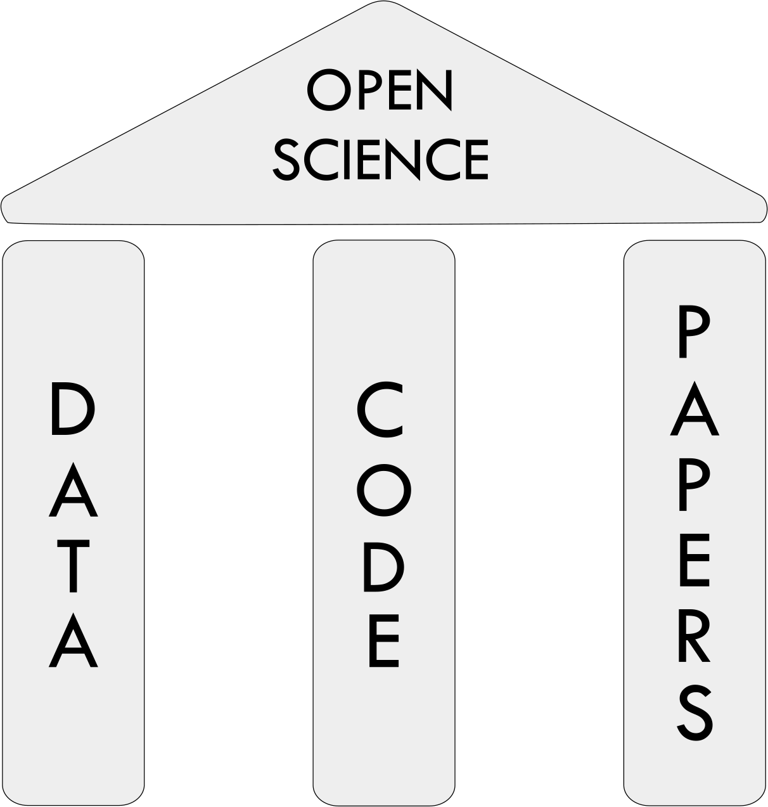
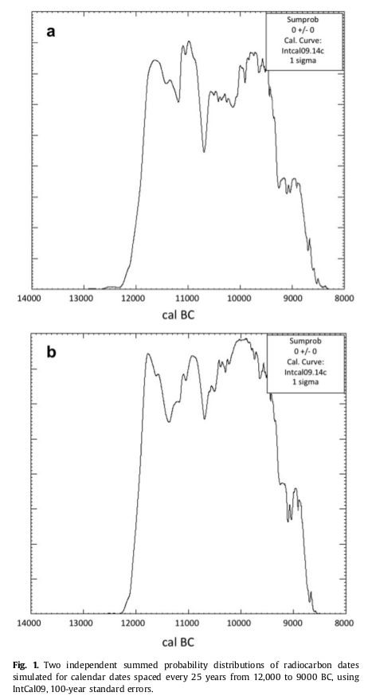
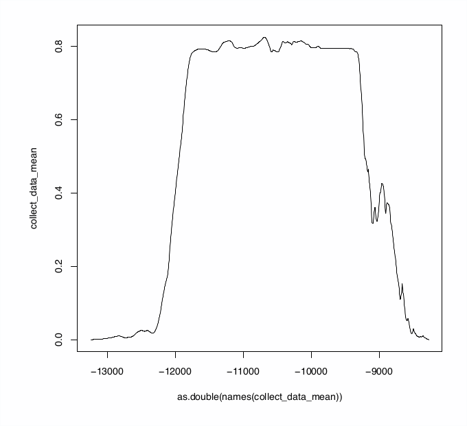
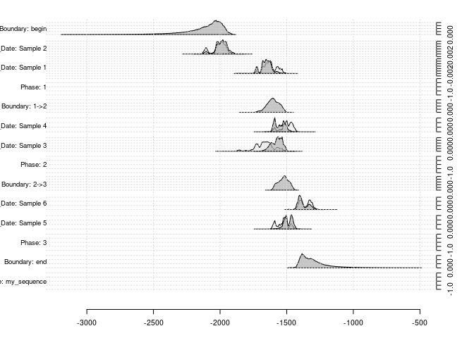

# Outline

- Reproducible Research
- Reproducible Research for 'sum calibration demography'
- Features of oxCAAR
- Doing sum calibration research with oxCAAR

---
class: inverse, bottom
# Reproducible Research

---

## what is Reproducible Research


.caption.pull-right[Peng 2011, Science 334(6060) pp. 1226-1227]

> 'The goal of reproducible research is to tie specific instructions to data analysis and experimental data so that scholarship can be recreated, better understood and verified.' - Max Kuhn, CRAN Task View: Reproducible Research


---
## what is Reproducible Research cont.

<center>

</center>
.caption.pull-right[Gorgolewski & Poldrack 2016]

> 'An article about computational science in a scientic publication is not the scholarship itself, it is merely advertising of the scholarship. The actual scholarship is the complete software development environment and the complete set of instructions which generated the figures.' - Buckheit and Donoho 1995

---

## why Reproducible Research

| Scientific Principles | traditional research | reproducible archaeological research |
|------------------------------------|---------------------------|--------------------------------------|
| Empirically Testable (observation) | ususally NA | x |
| Replicability | ususally NA | x |
| Objective | ? | ? |
| Transparency | partly | x |
| Falsifiable | ususally anecdotally only | x |
| Logically consistent | hopefully | controllable |

---
background-image: url(images/duffy.gif)
background-position: 50% 80%

## why also Reproducible Research

- why every time reinvent the wheel?
  - waste of tax money
  - constant frustration!
  - why should knowledge die with the scientist?

---
class: inverse, bottom
# Reproducible Research for 'sum calibration demography'

---
## why Reproducible Research for 'sum calibration demography'

- it's not the world's most uncontroversial method
- point-and-click working with OxCal does not increase credibility of the results

---
### you might say

> but OxCal includes a scripting language which can be used for reproducibility!

<pre>
Sequence("my_sequence"){
  Boundary("begin");
  Phase("first"){
    R_Date("ABC-123", 5020, 20);
    R_Date("ABC-321", 5200, 20);};
  Boundary("between");
  Phase("second"){
  R_Date("CBA-123", 5010, 20);
  R_Date("CBA-321", 4810, 20);};
  Boundary("end");
};
</pre>

---
## why Reproducible Research for 'sum calibration demography'

- it's not the world's most uncontroversial method
- point-and-click working with OxCal does not increase credibility of the results
- validation requires simulations

---
### 'eyeballing' simulation

<div class="pull-left">

<br/>
.caption[Bamforth & Grund 2012]
</div>
<div class="pull-right">

<br/>
.caption[resimulation with the same parameters, mean of 100 iterations]
</div>
<hr  style="clear:both;"/>

Bamforth & Grund 2012: Using two arbitrary simulated results for assuming correlation between 14C sum calibration and shape of the cal curve

---
## why Reproducible Research for 'sum calibration demography'

- it's not the world's most uncontroversial method
- point-and-click working with OxCal does not increase credibility of the results
- validation requires simulations
  - simulation requires repetition

---
### the 'ucl approach'

> We fitted an exponential GLM with a quasi-Poisson distributed error to a SCDPD constructed from all 14C dates from the entire study area, using the wider date range of 4,000–10,000 cal. BP (Fig. 2, Supplementary Table S1). Simulated SCDPDs (50,000) for each demographic region were generated by sampling n calendar dates from under the fitted GLM where n is the number of site phases in each region, and then converting to n14C dates by sampling from the calibration curve error at the corresponding calendar date. The simulated 14C dates were rounded using a Monte Carlo method to give the same proportion of different date roundings as that used by 14C laboratories, assigned errors by sampling with replacement from observed 14C data errors, and then calibrated using the same procedure as for the observed data. Finally, the simulated calibrated date probability distributions were summed and normalized to unity. - Shennan et al. 2013

---
### the 'ucl approach', for a lot of colleagues

> Chúng tôi trang bị GLM theo cấp số nhân với sai số phân bố quasi-Poisson cho SCDPD được xây dựng từ tất cả các ngày 14C từ toàn bộ khu vực nghiên cứu, sử dụng phạm vi ngày rộng hơn từ 4.000-10.000 cal. BP (Hình 2, Bảng bổ sung S1). Mô phỏng SCDPDs (50.000) cho mỗi khu vực nhân khẩu học được tạo ra bằng cách lấy mẫu n ngày tháng theo GLM được trang bị trong đó n là số pha của từng khu vực, sau đó chuyển thành ngày n14C bằng cách lấy mẫu từ sai số đường chuẩn tại lịch tương ứng ngày. Các ngày 14C mô phỏng được làm tròn bằng phương pháp Monte Carlo để cung cấp cùng tỷ lệ các vòng ngày khác nhau như được sử dụng bởi các phòng thí nghiệm 14C, được gán lỗi bằng cách lấy mẫu thay thế từ các lỗi dữ liệu 14C quan sát được, và hiệu chuẩn bằng cách sử dụng quy trình tương tự như dữ liệu. Cuối cùng, các bản phân phối xác suất ngày được hiệu chỉnh mô phỏng được tổng hợp và chuẩn hóa thành sự thống nhất. - Shennan et al. 2013

---
background-image: url(images/316px-Dr._Robert_Goddard_at_Clark_University_-_GPN-2002-000130.jpg)
background-size: cover
class: inverse, bottom

### Rocket Science!

---
## why Reproducible Research for 'sum calibration demography'

- it's not the world's most uncontroversial method
- point-and-click working with OxCal does not increase credibility of the results
- validation requires simulations
  - simulation requires repetition
  - when it comes to more complicated scripting, the actual script is beneficial for reproduction
- eg. 'R' +1

---
### Several possibilities for calibration

#### outside of R
* CalPal, BCal, CALIB, Fairbanks calibration, OxCal, iosacal, MatCal
* [calibrator](https://github.com/ISAAKiel/calibrator)
* ChronoModel

#### within R
* [Bchron](http://cran.rstudio.com/web/packages/Bchron/index.html)
  *  Andrew Parnell
* [rcarbon](https://cran.r-project.org/web/packages/rcarbon/index.html)
  *  Andrew Bevan
* [oxcAAR](https://cran.r-project.org/web/packages/oxcAAR/index.html)
  *  ISAAK

---
### Why another calibration package?

*1. Every package produces slightly different results*


*2. Sequential Calibration with other tools (currently) not available*



---
## why Reproducible Research for 'sum calibration demography'

- it's not the world's most uncontroversial method
- point-and-click working with OxCal does not increase credibility of the results
- validation requires simulations
  - simulation requires repetition
  - when it comes to more complicated scripting, the actual script is beneficial for reproduction
- eg. 'R' +1
- Sometimes it might be more 'reproducible' if you accept general standard software
  - in the long run actually you should change the standard, if it is opaque ...

---
class: inverse, bottom
# Features of oxCAAR

---
## Idea

 oxcAAR is a R package to **calibrate**, **simulate** and **sum** <sup>14</sup>C dates using **OxCal** as calibration engine

```{r echo = FALSE, message=FALSE}
if(!require('devtools')) install.packages('devtools')
library(devtools)
install_github('ISAAKiel/oxcAAR')
library(oxcAAR)
library(dplyr)
library(broom)
library(ggplot2)
```

```{r message=FALSE, size = 'tiny'}
quickSetupOxcal() # download Oxcal to tempory folder
oxcalCalibrate( bp=5000, std=20) # do the calibration
```

---
## Accessing the calibration result - structure

```{r message=FALSE, size = 'tiny'}
my_cal_date <- oxcalCalibrate( bp=5000, std=20)
str(my_cal_date, max.level = 3)
```

---
## Accessing the calibration result - for basic plot

```{r message=FALSE, size = 'tiny', out.width = "50%", fig.align = "center"}
plot(
  my_cal_date$`1`$raw_probabilities$dates,
  my_cal_date$`1`$raw_probabilities$probabilities,
  type = "l", xlab = "years", ylab = "probs"
)
```

---
## Features - plotting an individual date

Plotting an individual date

```{r message=FALSE, size = 'tiny', out.width = "50%", fig.align = "center"}
oxcalCalibrate( bp=5000, std=20) %>% plot()
```

---
## Features - plotting multiple dates

```{r message=FALSE, size = 'tiny', out.width = "50%", fig.align = "center"}
oxcalCalibrate( bp=c(5000,5200), std=c(20,25)) %>% plot()
```

---
## Features - plotting on the calibration curve

```{r message=FALSE, size = 'tiny', out.width = "50%", fig.align = "center"}
oxcalCalibrate( bp=c(5000,5200), std=c(20,25)) %>% calcurve_plot()
```

---
class: inverse, bottom
# Simulation

---
## Features - simulating a R_Date

```{r message=FALSE, size = 'tiny', out.width = "50%", fig.align = "center"}
oxcalSimulate(-3400, 25, "SimDate_1") %>% plot()
```

---
## Features - simulating a sum calibration

```{r message=FALSE, size = 'tiny', out.width = "50%", fig.align = "center"}
oxcalSumSim(
  timeframe_begin = -4000, # From when
  timeframe_end = -3000, # To when
  n = 50, # Number of dates
  stds = 35, # Standard deviation of dates (can also be a vector of length n)
  date_distribution = "uniform" # random uniform; alternatively: equidist for equidistant dates
) %>% plot()
```

---
### A sample (simulated) Dataset:

```{r echo=FALSE, message=FALSE, size = 'tiny', out.width = "50%", fig.align = "center"}
# random sample
my_bc_dates <- c(
  sample(6000:5001, 30),
  sample(5000:4001, 60),
  sample(4000:3001, 30)
)

# back calibration
intcal13 <- read.csv(
  "http://www.radiocarbon.org/IntCal13%20files/intcal13.14c",
  skip = 11, header=F)[,1:2]
colnames(intcal13) <- c("CAL BP", "14C age")
calf <- function(this_bp) {
  approx(intcal13$`CAL BP`,
         intcal13$`14C age`,
         this_bp)$y
}

my_bp_dates <- data.frame(names = 1:length(my_bc_dates),
                          bp = calf(my_bc_dates),
                          std = sample(c(25,33,50, 100), replace = T, size = length(my_bc_dates)))
```

```{r message=FALSE, size = 'tiny', out.width = "50%", fig.align = "center"}
my_result_data <- R_Date(names = my_bp_dates$names,
                         r_dates = my_bp_dates$bp,
                         std = my_bp_dates$std) %>% oxcal_Sum() %>%
  executeOxcalScript() %>%
  readOxcalOutput() %>%
  parseOxcalOutput(only.R_Date = FALSE, first = TRUE)

plot(my_result_data)
```

---
### Simulating a random envelope
.pull-left[
```{r message=FALSE, size = 'tiny', out.width = "50%", fig.align = "center"}
sim_result <- my_bp_dates %>%
  broom::bootstrap(2) %>%
  do(
    oxcalSumSim(
      n = nrow(my_bp_dates),
      stds = sample(my_bp_dates$std),
      timeframe_begin = -4000,
      timeframe_end = -1000,
      date_distribution = "uniform"
    )$raw_probabilities
  )

alpha = .05

envelope <- sim_result %>%
  group_by(dates) %>%
  summarize(
    low=quantile(probabilities, alpha / 2),
    high=quantile(probabilities, 1 - alpha / 2)
  )

# my_raw_probabilities <-
# my_result_data$` Sum `$raw_probabilities
#
# ggplot() +
#   geom_ribbon(data = envelope,
#               aes(x=dates,
#                   ymin=low,
#                   ymax = high),
#               alpha = .3) + 
#   geom_line(data = my_raw_probabilities,
#             aes(x=dates,
#                 y=probabilities),
#             color="red")
```
]

.pull-right[
```{r echo=F, message=FALSE, size = 'tiny', out.width = "100%", fig.align = "center"}
my_raw_probabilities <-
my_result_data$` Sum `$raw_probabilities
ggplot() +
  geom_ribbon(data = envelope, aes(x=dates,ymin=low, ymax = high), alpha = .3) + 
  geom_line(data = my_raw_probabilities, aes(x=dates,y=probabilities), color="red")
```
]

---
class: inverse, bottom
# Summary

---
background-image: url(images/logos/isaak_with_text.png)
background-position: 98% 95%
background-size: 25%

## oxCAAR as tool for reproducible 14C based research

* brings together the standard calibration tool and a mighty analytical environment
* adds the possibility to easy script simulations
* makes code exchange and discussion of methods and results very easy

https://cran.r-project.org/web/packages/oxcAAR/index.html

https://github.com/ISAAKiel/oxcAAR

<br>
<br>

.pull-left[### Thats all, folks!]


You find this presentation at:

https://martinhinz.github.io/eaa_2018_oxcaar_rep_research

and the code producing it at

https://github.com/MartinHinz/eaa_2018_oxcaar_rep_research
